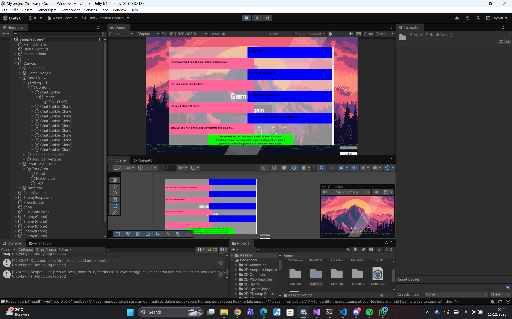
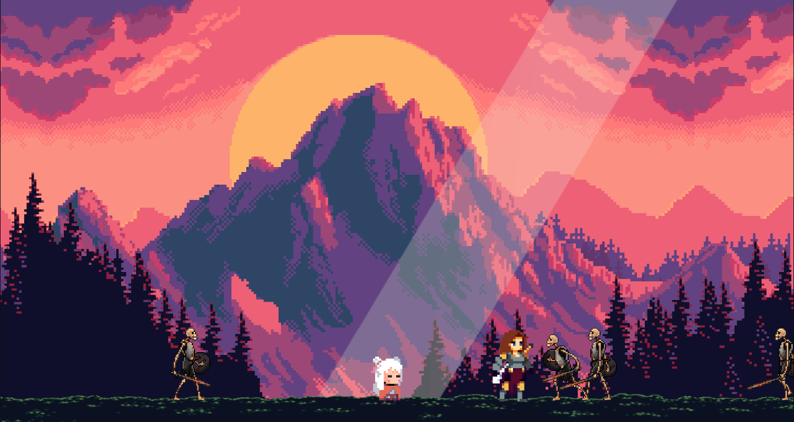

# Are You Okay?
This game was created out of the need for real, human-like conversations—especially conversations involving people with mental health conditions (in this case, ADHD).

The core idea is to build a psychology-oriented LLM that does not only respond to humans, but can genuinely connect with them. One major problem with current models is that a lot of pre-trained data comes from generative sources themselves, which often results in stiff or unnatural responses. As humans, we can easily feel when we are talking to a bot (which, of course, we are). However, my hope is that in the future, conversations can feel more natural even when the model size is relatively small—far below billions or trillions of parameters.

This is why I came up with this idea. According to Google, this approach is called Human-in-the-Loop (HITL):

```
A system where humans actively collaborate with AI/ML models by providing feedback, judgment, and oversight to improve accuracy, fairness, and reliability—especially in ambiguous situations where AI falls short—forming a continuous cycle of learning and refinement that balances automation efficiency with human nuance and ethics.
```



This game gives a “turning the tables” experience. Instead of the human asking for help, the LLM (named Nara) asks the player for help to solve its own problem. The player acts as the problem solver, with only five turns (or more, if configured).

At the end of the interaction, another LLM acts as a judge. It takes the entire conversation in JSON format and makes a decision on whether the player successfully helped Nara or not. If the player wins, the conversation will be uploaded (with consent and legal considerations) to Hugging Face, to be used later as part of the dataset for pre-training my LLM.

And to keep the game from feeling lame, i designed it so that player must defeat a certain number of skeletons before you can talk to Nara. 





